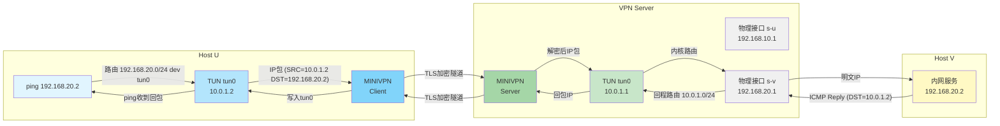

# MiniVPN — 基于 Rust 的微型 TLS/SSL VPN

## 设计思路

**项目目标**：从零实现一个微型 TLS/SSL VPN，通过 TUN 虚拟网卡劫持系统 IP 包，经 TLS 加密隧道转发，实现安全的网络通信。项目旨在深入理解 VPN 核心原理：TUN/TAP 虚拟网卡、TLS 握手与加密传输、PKI 证书体系、Linux 网络命名空间隔离及 poll 事件驱动编程。

**整体框架**：项目采用 Client-Server 架构，在三节点拓扑（Host U → VPN Server → Host V）上运行。Client 端拦截发往内网的 IP 包，经 TLS 加密后发往 Server；Server 解密后转发给内网目标主机，回包同理逆向。转发引擎采用单线程 `poll()` 事件循环，同时监听 TUN 虚拟网卡和物理 Socket，实现全双工非阻塞数据转发。

**迭代路径**：先实现 UDP 明文隧道验证 TUN 数据劫持和 poll 事件循环的正确性，再升级为 rustls 加密隧道，最后用 Wireshark 对比验证加密效果。

---

## 设计亮点

### 1. 单线程 poll 事件循环

不同于工业级 VPN 的多线程/异步架构，本项目的核心转发引擎是**单线程 `poll()` 事件循环**，在同一个线程中同时监听 `tun_fd` 和 `sock_fd`/`tcp_fd`。这一设计避免了多线程并发带来的锁竞争、死锁和同步问题，同时代码更简洁可验证。

```rust
// 核心架构：单线程同时监听两个 fd
loop {
    poll([tun_fd, sock_fd]);
    if tun_fd 可读: tun.recv() → 加密/发送
    if sock_fd 可读: 接收/解密 → tun.send()
}
```

### 2. 从多线程死锁到单线程的工程演进

TLS 隧道最初采用双线程架构（TUN→TLS 线程 + TLS→TUN 线程），因 `Mutex<Connection>` 竞争导致死锁。经调试改为单线程 poll 架构后问题解决。这一过程深刻展示了**共享状态并发**的风险和**事件驱动**的可靠性。

### 3. 纯 Rust 技术栈

使用 rustls 替代 OpenSSL C 库，规避了 C 语言内存安全风险；使用 tun crate 封装 `ioctl(TUNSETIFF)` 系统调用，API 更安全。

### 4. 明文 vs 加密对比验证

通过 Wireshark 在相同拓扑上分别抓取 UDP 明文隧道和 TLS 加密隧道的物理链路数据，直观验证 TLS 的机密性保护效果。

---

## 项目结构与设计细节

```
/home/minivpn/
├── Cargo.toml              # 依赖管理（rustls, tun, clap 等）
├── scripts/
│   ├── setup_topology.sh   # 三节点 netns 拓扑搭建
│   └── gen_pki.sh          # CA + Server 证书生成
├── pki/                    # 证书目录（ca.crt, server.crt, server.key）
└── src/
    ├── main.rs             # CLI 入口，解析 udp/tls 子命令
    ├── tun_dev.rs          # TUN 设备创建（封装 tun::create）
    ├── udp_tunnel.rs       # UDP 明文隧道（poll 循环）
    └── tls_tunnel.rs       # TLS 加密隧道（握手 + poll 循环）
```

### 模块关系图

```
                   ┌─────────────┐
                   │   main.rs   │  CLI 参数解析
                   └──────┬──────┘
                          │
          ┌───────────────┼───────────────┐
          │               │               │
          ▼               ▼               ▼
   ┌──────────┐   ┌────────────┐   ┌──────────────┐
   │ tun_dev  │   │udp_tunnel │   │ tls_tunnel   │
   │ TUN 封装  │   │ poll 循环  │   │ TLS 握手+转发│
   └────┬─────┘   └─────┬──────┘   └──────┬───────┘
        │               │                 │
        │         ┌─────▼──────┐    ┌─────▼──────┐
        │         │ libc::poll │    │ rustls     │
        │         │ (事件驱动)  │    │ (加密/解密) │
        │         └────────────┘    └────────────┘
        │
   ┌────▼──────────────────────────────────────────┐
   │          Linux ioctl(TUNSETIFF)               │
   │  ┌────────────┐  ┌──────────────────────────┐ │
   │  │ open("/dev │  │  siocsifaddr / siocsifmtu│ │
   │  │  /net/tun")│  │  (设置IP/MTU/UP)         │ │
   │  └────────────┘  └──────────────────────────┘ │
   └───────────────────────────────────────────────┘
```

### 数据流



---

## 测试方法与使用说明

### 环境要求

- Linux（推荐 WSL2 或原生 Linux）
- Rust 工具链（1.70+）
- `iproute2`、`openssl`、`tcpdump`（可选，用于抓包验证）

### 快速开始

```bash
# 1. 搭建拓扑（三节点网络命名空间）
sudo bash scripts/setup_topology.sh

# 2. 生成证书
bash scripts/gen_pki.sh

# 3. 编译
cargo build --release

# 4. 测试 UDP 明文隧道（不加密）
# 终端 1 — Server
sudo ip netns exec s ./target/release/minivpn udp \
  --role server --addr 192.168.10.1:4433 --tun 10.0.1.1

# 终端 2 — Client
sudo ip netns exec u ./target/release/minivpn udp \
  --role client --addr 192.168.10.1:4433 --tun 10.0.1.2

# 终端 3 — 添加路由并测试
sudo ip netns exec u ip route add 192.168.20.0/24 dev tun0
sudo ip netns exec s ip route add 10.0.1.0/24 dev tun0
sudo ip netns exec u ping -c 4 192.168.20.2

# 5. 测试 TLS 加密隧道
# 终端 1 — Server
sudo ip netns exec s ./target/release/minivpn tls \
  --role server --addr 192.168.10.1:4433 --tun 10.0.1.1 \
  --cert pki/server.crt --key pki/server.key

# 终端 2 — Client
sudo ip netns exec u ./target/release/minivpn tls \
  --role client --addr 192.168.10.1:4433 --tun 10.0.1.2 \
  --ca pki/ca.crt

# 终端 3 — 测试
sudo ip netns exec u ip route add 192.168.20.0/24 dev tun0
sudo ip netns exec s ip route add 10.0.1.0/24 dev tun0
sudo ip netns exec u ping -c 4 192.168.20.2
```

### 加密验证（Wireshark）

```bash
# 在 Server 物理口抓包
sudo ip netns exec s tcpdump -i s-u -X port 4433
```

对比 UDP 隧道（明文 ICMP 可见）和 TLS 隧道（仅见 TLS 密文）。

### 清理

```bash
sudo killall -9 minivpn
sudo ip netns exec u ip link del tun0 2>/dev/null
sudo ip netns exec s ip link del tun0 2>/dev/null
```

---

## 未来展望

- **支持 TAP 模式**：实现二层桥接 VPN，支持非 IP 协议
- **双向认证 mTLS**：客户端也出示证书，实现零信任接入控制
- **多客户端并发**：Server 端支持多个 Client 同时连接
- **性能优化**：引入 `io_uring` 或 `epoll` 替代 poll，提升高并发场景下的吞吐量
- **路由自动化**：自动配置策略路由，避免 Full Tunneling 死循环
- **跨平台**：支持 macOS（utun）和 Windows（wintun）

---

## License

MIT
